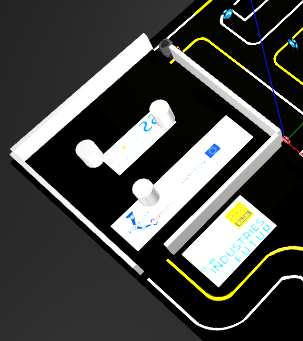
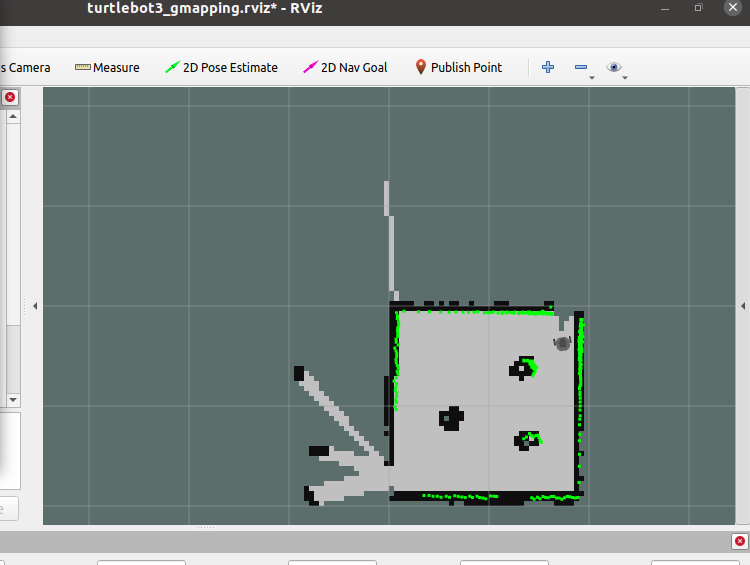

Tunnel
======
Le but de ce Tutoriel est de vous guider à réuissir la mission de Tunnel dans le cadre de turtlebot3_autorace

Prérequis
---------
- Robot Turtlebot3
- ROS Noetic installé
- Gazebo
- RVIZ
- Package turtlebot3_autorace
- Package turtlebot3_autorace2020

Création du map :
------------
Tout d'abord nous allons commencer par créer une map de notre tunnel, et pour faire ca nous allons utiliser la tehcnique SLAM(Simultaneous Localization and Mapping). 

1. Lancer Gazebo
~~~~~~~~~~~~~~~~ 
Terminal 1 : Ouvrez un terminal et exécutez la commande suivante pour lancer l'environnement Gazebo :

.. code-block:: bash

    export TURTLEBOT3_MODEL=burger
    roslaunch turtlebot3_gazebo turtlebot3_autorace_2020.launch

2. Lancer Teleoperation
~~~~~~~~~~~~~~~~~~~~~~~ 
Terminal 2 : Ouvrez un nouveau terminal et exécuter les commandes suivantes  :

.. code-block:: bash

    export TURTLEBOT3_MODEL=burger
    roslaunch turtlebot3_teleop turtlebot3_teleop_key.launch

faites avancer votre Robot jusqu'à l'entrée du Tunnel 

2. SLAM Node 
~~~~~~~~~~~~~~~~~~~~~~~ 
Terminal 3 : Ouvrez un nouveau terminal et exécuter les commandes suivantes :

.. code-block:: bash

    export TURTLEBOT3_MODEL=burger
    roslaunch turtlebot3_slam turtlebot3_slam.launch slam_methods:=gmapping

après l'exécution de cette ligne , RVIZ sera lancé, maintenat à l'aide de teleop déjà lancée dans terminal 2 vous devez parcourir le Tunnel afin de créer une map de ce dernier 

